# [CIS565 2015F] GLSL-Ray-Marcher

**GLSL Ray Marching**

**University of Pennsylvania, CIS 565: GPU Programming and Architecture, Project 5**

* Zhimin Zhao
* Tested on: Chrome - Version 45.0.2454.93 m
  Windows 10, i5-5200U @ 2.20GHz 8.0GB, GTX 960M 

### Live on Shadertoy 

[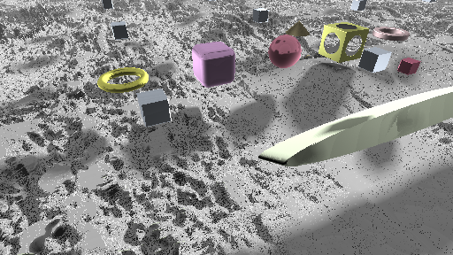](https://www.shadertoy.com/view/XtBXRc)

### Acknowledgements

This Shadertoy uses material from the following resources:

iq Cloudy Terrain:

https://www.shadertoy.com/view/MdlGW7

iq RayMarching Primitives:

https://www.shadertoy.com/view/Xds3zN

Numerical Methods for Ray Tracing Implicitly Defined Surfaces:

http://graphics.cs.williams.edu/courses/cs371/f14/reading/implicit.pdf

others:

http://www.iquilezles.org/www/articles/distfunctions/distfunctions.htm

### ReadMe
note: to use "#define terrMap" the "#define naive" should be used at the same time 

**Features:**
* Two ray marching methods: 
  * Naive ray marching :#define naive
  * Sphere tracing
* different distance estimators & operation
  * Box,wheel,roundBox,plane,cone,Torus,cylinder
  * operation: subtraction,repeat
  * With normal computation 
* One simple lighting computatio: Blinn-Phong.
* Union operator :float opU(...){}
* Transformation operator: float opTrans(..){}
* Lighting effects
  *  Soft shadowing using secondary rays {iq-prim} {iq-rwwtt p55}
  *  Ambient occlusion  {iq-prim}
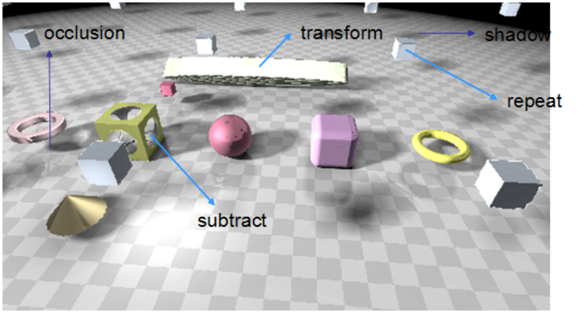
* Debug views 
  * Distance to surface for each pixel: #define debugView1
  * Number of ray march iterations used for each pixel:  #define debugView2

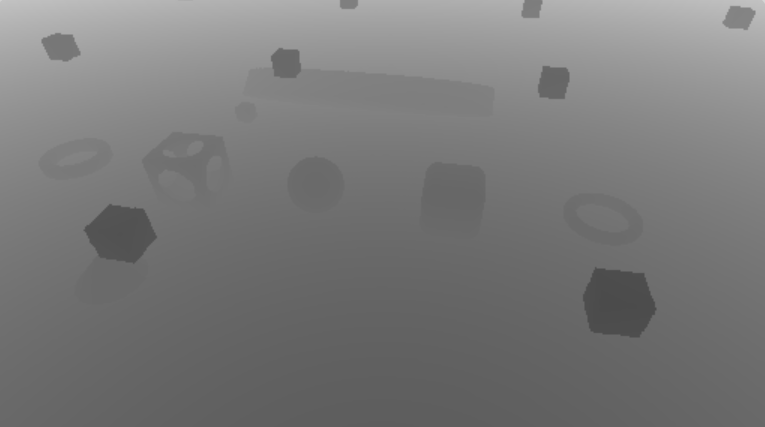  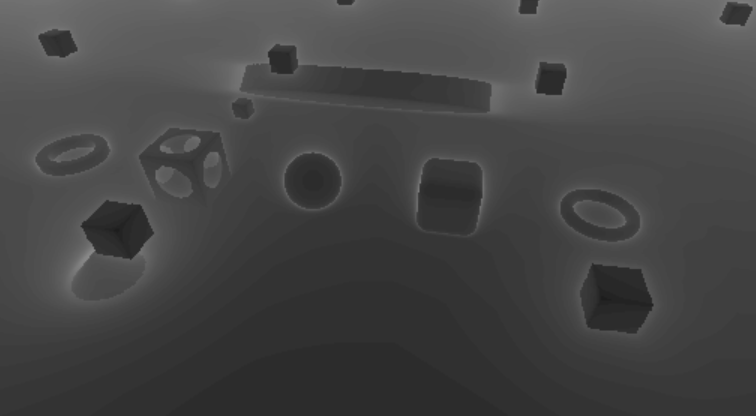

* Advanced distance estimators
  *  Height-mapped terrain rendering: (texture base) 

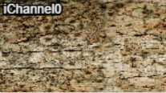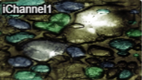

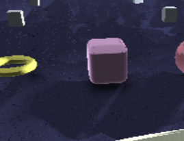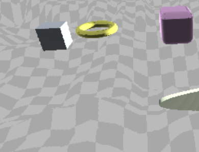

### Analysis

* Provide an analysis comparing naive ray marching with sphere tracing
   
naive ray marching: 5.6fps; 132 ms

   
accelated ray marching : 60.1fps; 22.5 ms

* the "most expensive" fragments by number of iterations required for each pixel.
  
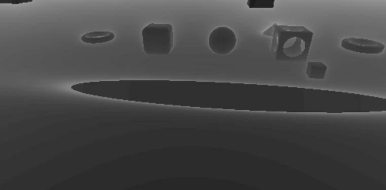

  the first one is using naive ray marching, the whiter the number of iteration is bigger. the shadow I calculate using 
the fixed footstep, so it iterates much. The naive ray marching is much more "expensive"

* Compare time spent ray marching vs. time spent shading/lighting: 
 
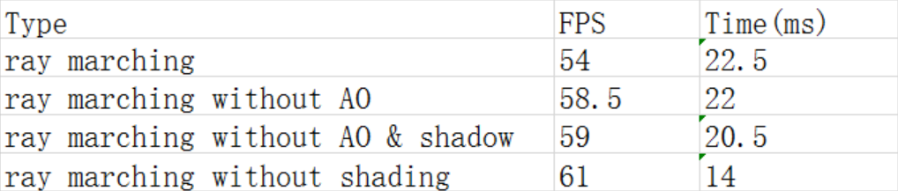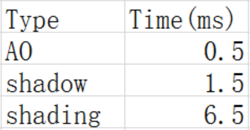

 
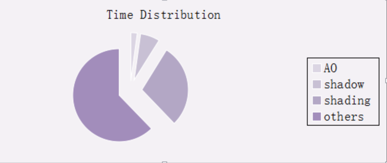

### Resources

For any code/material in the 565 [slides](http://cis565-fall-2015.github.io/lectures/12-Ray-Marching.pptx),
please reference the source found at the bottom of the slide.

* {McGuire}
  Morgan McGuire, Williams College.
  *Numerical Methods for Ray Tracing Implicitly Defined Surfaces* (2014).
  [PDF](http://graphics.cs.williams.edu/courses/cs371/f14/reading/implicit.pdf)
  * You may credit and use code from this reference.
* {iq-prim}
  Iñigo Quílez.
  *Raymarching Primitives* (2013).
  [Shadertoy](https://www.shadertoy.com/view/Xds3zN)
* {iq-terr}
  Iñigo Quílez.
  *Terrain Raymarching* (2007).
  [Article](http://www.iquilezles.org/www/articles/terrainmarching/terrainmarching.htm)
  * You may credit and use code from this reference.
* {iq-rwwtt}
  Iñigo Quílez.
  *Rendering Worlds with Two Triangles with raytracing on the GPU* (2008).
  [Slides](http://www.iquilezles.org/www/material/nvscene2008/rwwtt.pdf)
* {Ashima}
  Ashima Arts, Ian McEwan, Stefan Gustavson.
  *webgl-noise*.
  [GitHub](https://github.com/ashima/webgl-noise)
  * You may use this code under the MIT-expat license.

